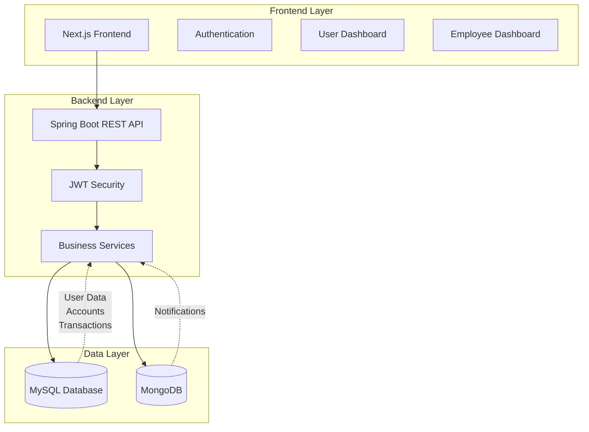
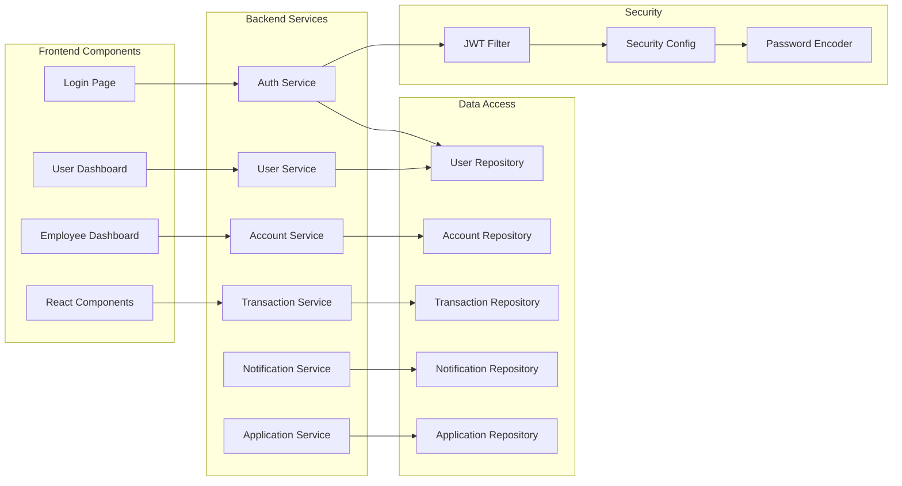
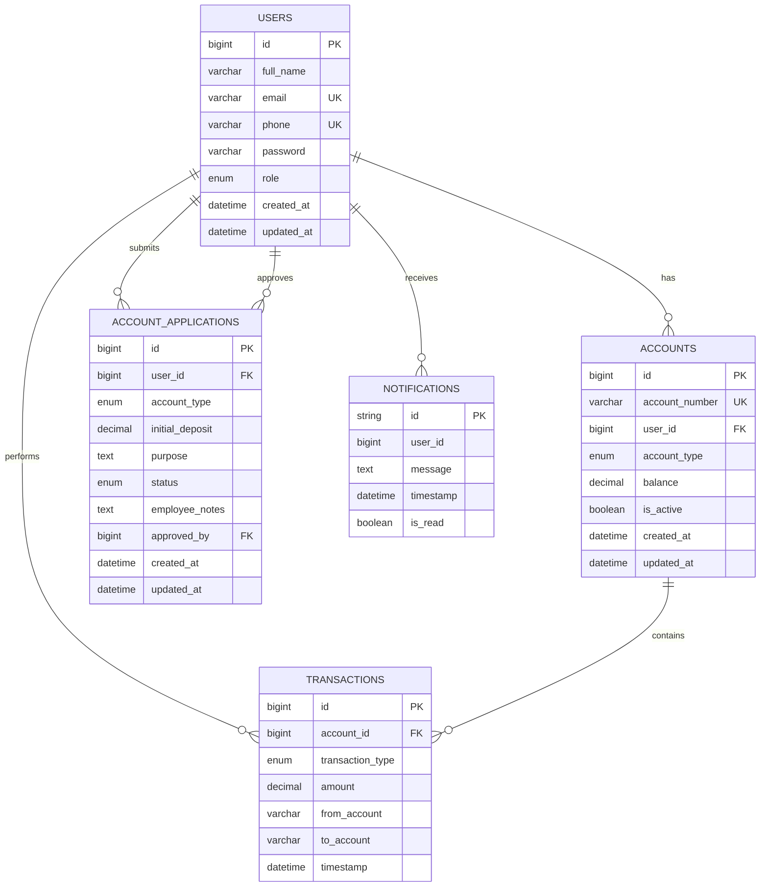

# Banking Management System

A modern, full-stack banking management system built with Spring Boot backend and Next.js frontend, featuring role-based access control, real-time notifications, and comprehensive transaction management.

## 🏗️ System Architecture

### High-Level Design (HLD)



### Low-Level Design (LLD)



## 🗄️ Entity Relationship Diagram



## 🛠️ Tech Stack

### Backend
- **Framework**: Spring Boot 3.5.3
- **Language**: Java 24
- **Database**: MySQL 8.3.0 (Primary), MongoDB 5.5.1 (Notifications)
- **Security**: Spring Security with JWT
- **ORM**: Spring Data JPA (MySQL), Spring Data MongoDB
- **Validation**: Bean Validation
- **Documentation**: OpenAPI 3.0 (Swagger)
- **Build Tool**: Maven
- **Lombok**: For reducing boilerplate code

### Frontend
- **Framework**: Next.js 15.3.4
- **Language**: TypeScript 5
- **Styling**: Tailwind CSS 4
- **HTTP Client**: Axios
- **State Management**: React Context API
- **Authentication**: JWT with localStorage
- **Build Tool**: npm

### Development Tools
- **IDE**: Any Java/TypeScript IDE
- **Database**: MySQL Workbench, MongoDB Compass
- **API Testing**: Postman, Swagger UI
- **Version Control**: Git

## 📋 Requirements

### Functional Requirements

#### User Management
- [x] User registration and authentication
- [x] Role-based access control (USER, EMPLOYEE)
- [x] User profile management
- [x] User deactivation by employees

#### Account Management
- [x] Account creation through application process
- [x] Multiple account types (Savings, Checking)
- [x] Account balance tracking
- [x] Account status management

#### Transaction Management
- [x] Fund transfers between accounts
- [x] Transaction history and mini-statements
- [x] Transaction search and filtering
- [x] Transaction type categorization

#### Application Management
- [x] Account application submission
- [x] Application approval/rejection workflow
- [x] Application status tracking
- [x] Employee notes and decision tracking

#### Notification System
- [x] Real-time notifications for users
- [x] Notification read/unread status
- [x] Notification history

#### Employee Dashboard
- [x] System overview and statistics
- [x] User management interface
- [x] Transaction monitoring
- [x] Application processing

### Non-Functional Requirements

#### Performance
- [x] Response time < 2 seconds for API calls
- [x] Support for 100+ concurrent users
- [x] Efficient database queries with indexing

#### Security
- [x] JWT-based authentication
- [x] Password encryption (BCrypt)
- [x] Role-based authorization
- [x] CORS configuration
- [x] Input validation and sanitization

#### Scalability
- [x] Modular architecture
- [x] Separate databases for different concerns
- [x] Stateless API design

#### Usability
- [x] Responsive web interface
- [x] Intuitive navigation
- [x] Error handling and user feedback
- [x] Loading states and progress indicators

#### Reliability
- [x] Transaction rollback on failures
- [x] Data consistency across databases
- [x] Error logging and monitoring

## 🔌 API Routes

### Authentication
```
POST   /api/auth/register          - User registration
POST   /api/auth/login             - User login
```

### User Management
```
GET    /api/users/profile          - Get user profile
PUT    /api/users/profile          - Update user profile
GET    /api/employee/users         - Get all users (Employee only)
GET    /api/employee/users/{id}    - Get user by ID (Employee only)
PUT    /api/employee/users/{id}    - Update user (Employee only)
POST   /api/employee/users         - Create user (Employee only)
PUT    /api/employee/users/{id}/deactivate - Deactivate user (Employee only)
```

### Account Management
```
GET    /api/accounts               - Get user accounts
POST   /api/accounts               - Create account (Employee only)
GET    /api/accounts/{number}      - Get account by number
PUT    /api/accounts/{number}      - Update account
GET    /api/employee/accounts      - Get all accounts (Employee only)
```

### Transaction Management
```
POST   /api/transactions/transfer  - Transfer funds
GET    /api/transactions/mini-statement/{accountNumber} - Get mini statement
GET    /api/employee/transactions  - Get all transactions (Employee only)
GET    /api/employee/transactions/search - Search transactions (Employee only)
```

### Account Applications
```
POST   /api/applications           - Submit application
GET    /api/applications           - Get user applications
GET    /api/applications/pending   - Get pending applications (Employee only)
GET    /api/applications/{id}      - Get application by ID
POST   /api/applications/process   - Process application (Employee only)
GET    /api/employee/applications  - Get all applications (Employee only)
```

### Notifications
```
GET    /api/notifications          - Get user notifications
PUT    /api/notifications/{id}/read - Mark notification as read
DELETE /api/notifications/{id}     - Delete notification
```

### System Statistics (Employee only)
```
GET    /api/employee/stats         - Get system statistics
```

## 🚀 Getting Started

### Prerequisites
- Java 24 or higher
- Node.js 18 or higher
- MySQL 8.0 or higher
- MongoDB 5.0 or higher
- Maven 3.6 or higher

### Backend Setup

1. **Clone the repository**
   ```bash
   git clone <repository-url>
   cd BankingSystem
   ```

2. **Configure MySQL Database**
   ```sql
   CREATE DATABASE banking_system;
   CREATE USER 'bank_user'@'localhost' IDENTIFIED BY 'bank_password';
   GRANT ALL PRIVILEGES ON banking_system.* TO 'bank_user'@'localhost';
   FLUSH PRIVILEGES;
   ```

3. **Configure MongoDB**
   ```bash
   # Start MongoDB service
   mongod
   ```

4. **Update application.properties**
   ```properties
   # Database Configuration
   spring.datasource.url=jdbc:mysql://localhost:3306/banking_system
   spring.datasource.username=bank_user
   spring.datasource.password=bank_password
   
   # MongoDB Configuration
   spring.data.mongodb.uri=mongodb://localhost:27017/banking_system
   
   # JWT Configuration
   app.jwt-secret=your-secret-key-here
   app.jwt-expiration-milliseconds=86400000
   ```

5. **Run the backend**
   ```bash
   mvn spring-boot:run
   ```

### Frontend Setup

1. **Navigate to frontend directory**
   ```bash
   cd frontend/bank-frontend
   ```

2. **Install dependencies**
   ```bash
   npm install
   ```

3. **Configure environment variables**
   ```bash
   cp env.example .env.local
   ```
   
   Update `.env.local`:
   ```env
   NEXT_PUBLIC_API_BASE_URL=http://localhost:8080/api
   NEXT_PUBLIC_JWT_STORAGE_KEY=bank_jwt
   ```

4. **Run the frontend**
   ```bash
   npm run dev
   ```

## 🧪 Testing

### Default Test Users

#### Employee/Admin User
- **Email**: `admin@bank.com`
- **Password**: `admin123`
- **Role**: EMPLOYEE
- **Access**: Full system access, user management, transaction monitoring

#### Test User
- **Email**: `test@gmail.com`
- **Password**: `test123`
- **Role**: USER
- **Access**: Personal account management, transactions, applications

### Testing Scenarios

#### User Registration & Login
1. Register a new user account
2. Login with credentials
3. Verify role-based redirects

#### Account Management
1. Submit account application as user
2. Approve application as employee
3. Verify account creation
4. Test fund transfers

#### Transaction Management
1. Perform fund transfers
2. View transaction history
3. Test transaction search (employee)

#### Employee Features
1. View system statistics
2. Manage users
3. Process applications
4. Monitor transactions

## 📁 Project Structure

```
BankingSystem/
├── src/main/java/com/bank/BankingSystem/
│   ├── config/                 # Configuration classes
│   ├── controller/             # REST controllers
│   ├── dto/                   # Data Transfer Objects
│   ├── entity/                # JPA entities
│   │   └── enums/            # Enumeration classes
│   ├── repository/            # Data access layer
│   ├── security/              # Security configuration
│   └── service/               # Business logic
│       └── impl/             # Service implementations
├── frontend/bank-frontend/
│   ├── src/app/
│   │   ├── components/        # React components
│   │   ├── contexts/          # React contexts
│   │   ├── services/          # API services
│   │   └── config/           # Configuration
│   └── public/               # Static assets
└── docs/                     # Documentation
```

## 🔧 Configuration

### Environment Variables

#### Backend (.properties)
```properties
# Server
server.port=8080

# Database
spring.datasource.url=jdbc:mysql://localhost:3306/banking_system
spring.datasource.username=bank_user
spring.datasource.password=bank_password

# MongoDB
spring.data.mongodb.uri=mongodb://localhost:27017/banking_system

# JWT
app.jwt-secret=your-secret-key-here
app.jwt-expiration-milliseconds=86400000

# Logging
logging.level.com.bank.BankingSystem=DEBUG
```

#### Frontend (.env.local)
```env
NEXT_PUBLIC_API_BASE_URL=http://localhost:8080/api
NEXT_PUBLIC_JWT_STORAGE_KEY=bank_jwt
NEXT_PUBLIC_APP_NAME=Banking Management System
NODE_ENV=development
```

## 🚀 Deployment

### Backend Deployment
1. Build the JAR file: `mvn clean package`
2. Deploy to application server or run as standalone
3. Configure production database connections
4. Set up environment variables

### Frontend Deployment
1. Build the application: `npm run build`
2. Deploy to Vercel, Netlify, or any static hosting
3. Configure production API endpoints
4. Set up environment variables

## 🔒 Security Considerations

- JWT tokens are stored in localStorage (consider httpOnly cookies for production)
- Passwords are encrypted using BCrypt
- CORS is configured for development (restrict for production)
- Input validation is implemented on both frontend and backend
- Role-based access control is enforced

## 📈 Future Enhancements

### Planned Features
- [ ] Real-time notifications using WebSocket
- [ ] Email notifications
- [ ] PDF statement generation
- [ ] Mobile application
- [ ] Advanced reporting and analytics
- [ ] Multi-currency support
- [ ] Loan management system
- [ ] Credit card management
- [ ] ATM integration
- [ ] Fraud detection system

### Technical Improvements
- [ ] Redis caching for better performance
- [ ] Message queue for async processing
- [ ] Microservices architecture
- [ ] Docker containerization
- [ ] CI/CD pipeline
- [ ] Automated testing
- [ ] Performance monitoring
- [ ] Database sharding for scalability

## 🤝 Contributing

1. Fork the repository
2. Create a feature branch
3. Make your changes
4. Add tests if applicable
5. Submit a pull request

## 📄 License

This project is licensed under the MIT License - see the LICENSE file for details.

## 📞 Support

For support and questions:
- Create an issue in the repository
- Contact the development team
- Check the documentation

---

**Note**: This is a demonstration project. For production use, implement additional security measures, proper error handling, and comprehensive testing. 